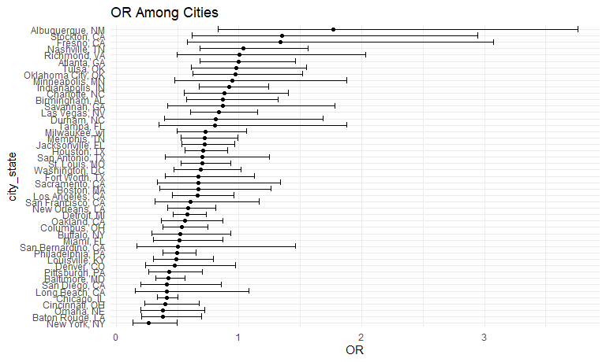

Homework 6
================
Shaolei Ma
2023-11-22

# Problem 1

Use the data cleaning procedure similar to HW5. Omit certain cities as
instructed.

``` r
homicide_df = 
  read_csv("data/homicide-data.csv", na = c("", "NA", "Unknown")) |> 
  mutate(
    city_state = str_c(city, state, sep = ", "),
    resolution = factor(
      case_when(
        disposition == "Closed without arrest" ~ "0",
        disposition == "Open/No arrest"        ~ "0",
        disposition == "Closed by arrest"      ~ "1"
    ),
    labels = c("unsolved", "solved"))
  ) |>  
  filter(
    city_state != "Tulsa, AL",
    city_state != "Dallas, TX",
    city_state != "Phoenix, AZ",
    city_state != "Kansas City, MO"
  )
```

    ## Rows: 52179 Columns: 12
    ## ── Column specification ────────────────────────────────────────────────────────
    ## Delimiter: ","
    ## chr (8): uid, victim_last, victim_first, victim_race, victim_sex, city, stat...
    ## dbl (4): reported_date, victim_age, lat, lon
    ## 
    ## ℹ Use `spec()` to retrieve the full column specification for this data.
    ## ℹ Specify the column types or set `show_col_types = FALSE` to quiet this message.

The resulting dataframe has 48507 entries, on variables that include the
victim name, race, age, and sex; the date the homicide was reported; and
the location of the homicide. In cleaning, I created a `city_state`
variable that includes both city and state, and a `resolution` variable
to indicate whether the case was closed by arrest.

For the city of Baltimore, MD, use the `glm` function to fit a logistic
regression with resolved vs unresolved as the outcome and victim age,
sex and race as predictors.

``` r
baltimore_fit = 
  homicide_df |> 
  filter(city_state == "Baltimore, MD") |> 
  glm(resolution ~ victim_age + victim_sex + victim_race, data = _, family = binomial())

baltimore_fit |> 
  broom::tidy() |> 
  mutate(
    conf_low = estimate - 1.96 * std.error,
    conf_high = estimate + 1.96 * std.error,
    OR = exp(estimate),
    OR_conf_low = exp(conf_low),
    OR_conf_high = exp(conf_high)
  ) |> 
  filter(term == "victim_sexMale") |> 
  select(term, starts_with("OR"))
```

    ## # A tibble: 1 × 4
    ##   term              OR OR_conf_low OR_conf_high
    ##   <chr>          <dbl>       <dbl>        <dbl>
    ## 1 victim_sexMale 0.415       0.318        0.542

The adjusted odds ratio for solving homicides comparing male victims to
female victims has an estimated value of 0.415 and a confidence interval
\[0.318, 0.542\].

Now, run `glm` for each of the cities in the dataset, and extract the
adjusted odds ratio (and CI) for solving homicides comparing male
victims to female victims.

``` r
OR_sex_df =
  homicide_df |> 
  nest(df = - city_state) |> 
  mutate(
    models = map(df, \(df) glm(resolution ~ victim_age + victim_sex + victim_race, data = df, family = binomial())),
    results = map(models, broom::tidy)
  ) |> 
  select(city_state, results) |> 
  unnest(results) |> 
  filter(term == "victim_sexMale") |>
  mutate(
    conf_low = estimate - 1.96 * std.error,
    conf_high = estimate + 1.96 * std.error,
    OR = exp(estimate),
    OR_conf_low = exp(conf_low),
    OR_conf_high = exp(conf_high)
  ) |> 
  select(city_state, term, starts_with("OR")) |> 
  arrange(OR)

OR_sex_df |> 
  knitr::kable()
```

| city_state         | term           |        OR | OR_conf_low | OR_conf_high |
|:-------------------|:---------------|----------:|------------:|-------------:|
| New York, NY       | victim_sexMale | 0.3534943 |   0.2172098 |    0.5752881 |
| Omaha, NE          | victim_sexMale | 0.3666460 |   0.1961511 |    0.6853352 |
| Baton Rouge, LA    | victim_sexMale | 0.3836552 |   0.2134893 |    0.6894551 |
| Cincinnati, OH     | victim_sexMale | 0.3997962 |   0.2361423 |    0.6768672 |
| Baltimore, MD      | victim_sexMale | 0.4149236 |   0.3175505 |    0.5421552 |
| Chicago, IL        | victim_sexMale | 0.4173408 |   0.3488935 |    0.4992164 |
| Denver, CO         | victim_sexMale | 0.4226786 |   0.2389768 |    0.7475922 |
| Pittsburgh, PA     | victim_sexMale | 0.4516411 |   0.2790792 |    0.7309024 |
| Philadelphia, PA   | victim_sexMale | 0.4692925 |   0.3655176 |    0.6025303 |
| Louisville, KY     | victim_sexMale | 0.4863049 |   0.3022577 |    0.7824201 |
| Oakland, CA        | victim_sexMale | 0.4909072 |   0.3313522 |    0.7272922 |
| Long Beach, CA     | victim_sexMale | 0.5002506 |   0.2617271 |    0.9561512 |
| Boston, MA         | victim_sexMale | 0.5041039 |   0.2879192 |    0.8826111 |
| Miami, FL          | victim_sexMale | 0.5277029 |   0.3155744 |    0.8824239 |
| Columbus, OH       | victim_sexMale | 0.5327984 |   0.3811893 |    0.7447065 |
| Fresno, CA         | victim_sexMale | 0.5419718 |   0.3019726 |    0.9727155 |
| Buffalo, NY        | victim_sexMale | 0.5592209 |   0.3196387 |    0.9783800 |
| San Francisco, CA  | victim_sexMale | 0.5623099 |   0.3243228 |    0.9749310 |
| Sacramento, CA     | victim_sexMale | 0.5633941 |   0.3101489 |    1.0234212 |
| Detroit, MI        | victim_sexMale | 0.5736762 |   0.4563493 |    0.7211677 |
| New Orleans, LA    | victim_sexMale | 0.6129262 |   0.4441645 |    0.8458094 |
| Tampa, FL          | victim_sexMale | 0.6280748 |   0.2841070 |    1.3884838 |
| San Bernardino, CA | victim_sexMale | 0.6321796 |   0.3027438 |    1.3200967 |
| Durham, NC         | victim_sexMale | 0.6357625 |   0.3146948 |    1.2843999 |
| San Diego, CA      | victim_sexMale | 0.6840284 |   0.4184916 |    1.1180506 |
| Washington, DC     | victim_sexMale | 0.6843563 |   0.4714173 |    0.9934797 |
| Los Angeles, CA    | victim_sexMale | 0.6868063 |   0.5285867 |    0.8923850 |
| St. Louis, MO      | victim_sexMale | 0.7118073 |   0.5378890 |    0.9419593 |
| Houston, TX        | victim_sexMale | 0.7150559 |   0.5890862 |    0.8679628 |
| Jacksonville, FL   | victim_sexMale | 0.7289855 |   0.5445355 |    0.9759141 |
| Memphis, TN        | victim_sexMale | 0.7302739 |   0.5387990 |    0.9897940 |
| Milwaukee, wI      | victim_sexMale | 0.7640716 |   0.5366526 |    1.0878647 |
| Fort Worth, TX     | victim_sexMale | 0.8278193 |   0.5404234 |    1.2680517 |
| Oklahoma City, OK  | victim_sexMale | 0.8515297 |   0.5714881 |    1.2687977 |
| Minneapolis, MN    | victim_sexMale | 0.8545559 |   0.4573401 |    1.5967676 |
| Savannah, GA       | victim_sexMale | 0.8679311 |   0.4227346 |    1.7819795 |
| Indianapolis, IN   | victim_sexMale | 0.8771747 |   0.6554114 |    1.1739734 |
| Birmingham, AL     | victim_sexMale | 0.8837842 |   0.5844724 |    1.3363755 |
| Charlotte, NC      | victim_sexMale | 0.8925324 |   0.5779969 |    1.3782324 |
| San Antonio, TX    | victim_sexMale | 0.9010570 |   0.6355538 |    1.2774745 |
| Las Vegas, NV      | victim_sexMale | 0.9507519 |   0.7308924 |    1.2367474 |
| Atlanta, GA        | victim_sexMale | 0.9952673 |   0.6820366 |    1.4523518 |
| Tulsa, OK          | victim_sexMale | 1.0046523 |   0.6516721 |    1.5488252 |
| Richmond, VA       | victim_sexMale | 1.0061916 |   0.4975313 |    2.0348903 |
| Nashville, TN      | victim_sexMale | 1.0211824 |   0.6786657 |    1.5365644 |
| Stockton, CA       | victim_sexMale | 1.0614351 |   0.6024505 |    1.8701031 |
| Albuquerque, NM    | victim_sexMale | 1.5330711 |   0.8430003 |    2.7880263 |

Create a plot that shows the estimated ORs and CIs for each city.

``` r
OR_sex_df |> 
  mutate(city_state = fct_reorder(city_state, OR)) |> 
  ggplot(aes(x = OR, y = city_state)) +
  geom_point() +
  geom_errorbar(aes(xmin = OR_conf_low, xmax = OR_conf_high)) +
  labs(title = "OR Among Cities")
```



It could be concluded that New York, NY has the lowest OR, while
Albuquerque, NM has the highest OR in terms of solving homicides
comparing male victims to female victims.

# Problem 2
