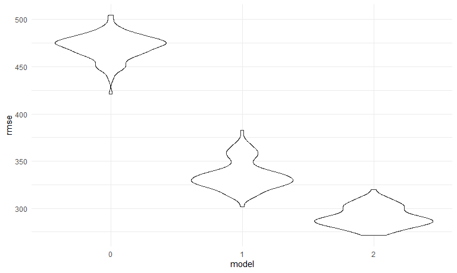

Homework 6
================
Shaolei Ma
2023-11-30

# Problem 1

Use the data cleaning procedure similar to HW5. Omit certain cities as
instructed.

``` r
homicide_df = 
  read_csv("data/homicide-data.csv", na = c("", "NA", "Unknown")) |> 
  mutate(
    city_state = str_c(city, state, sep = ", "),
    resolution = factor(
      case_when(
        disposition == "Closed without arrest" ~ "0",
        disposition == "Open/No arrest"        ~ "0",
        disposition == "Closed by arrest"      ~ "1"
    ),
    labels = c("unsolved", "solved"))
  ) |>  
  filter(
    city_state != "Tulsa, AL",
    city_state != "Dallas, TX",
    city_state != "Phoenix, AZ",
    city_state != "Kansas City, MO",
    victim_race %in% c("White", "Black")
  )
```

    ## Rows: 52179 Columns: 12
    ## ── Column specification ────────────────────────────────────────────────────────
    ## Delimiter: ","
    ## chr (8): uid, victim_last, victim_first, victim_race, victim_sex, city, stat...
    ## dbl (4): reported_date, victim_age, lat, lon
    ## 
    ## ℹ Use `spec()` to retrieve the full column specification for this data.
    ## ℹ Specify the column types or set `show_col_types = FALSE` to quiet this message.

The resulting dataframe has 39693 entries, on variables that include the
victim name, race, age, and sex; the date the homicide was reported; and
the location of the homicide. In cleaning, I created a `city_state`
variable that includes both city and state, and a `resolution` variable
to indicate whether the case was closed by arrest.

For the city of Baltimore, MD, use the `glm` function to fit a logistic
regression with resolved vs unresolved as the outcome and victim age,
sex and race as predictors.

``` r
baltimore_fit = 
  homicide_df |> 
  filter(city_state == "Baltimore, MD") |> 
  glm(resolution ~ victim_age + victim_sex + victim_race, data = _, family = binomial())

baltimore_fit |> 
  broom::tidy() |> 
  mutate(
    conf_low = estimate - 1.96 * std.error,
    conf_high = estimate + 1.96 * std.error,
    OR = exp(estimate),
    OR_conf_low = exp(conf_low),
    OR_conf_high = exp(conf_high)
  ) |> 
  filter(term == "victim_sexMale") |> 
  select(term, starts_with("OR"))
```

    ## # A tibble: 1 × 4
    ##   term              OR OR_conf_low OR_conf_high
    ##   <chr>          <dbl>       <dbl>        <dbl>
    ## 1 victim_sexMale 0.426       0.325        0.558

The adjusted odds ratio for solving homicides comparing male victims to
female victims has an estimated value of 0.415 and a confidence interval
\[0.318, 0.542\].

Now, run `glm` for each of the cities in the dataset, and extract the
adjusted odds ratio (and CI) for solving homicides comparing male
victims to female victims.

``` r
OR_sex_df =
  homicide_df |> 
  nest(df = - city_state) |> 
  mutate(
    models = map(df, \(df) glm(resolution ~ victim_age + victim_sex + victim_race, data = df, family = binomial())),
    results = map(models, broom::tidy)
  ) |> 
  select(city_state, results) |> 
  unnest(results) |> 
  filter(term == "victim_sexMale") |>
  mutate(
    conf_low = estimate - 1.96 * std.error,
    conf_high = estimate + 1.96 * std.error,
    OR = exp(estimate),
    OR_conf_low = exp(conf_low),
    OR_conf_high = exp(conf_high)
  ) |> 
  select(city_state, term, starts_with("OR")) |> 
  arrange(OR)

OR_sex_df |> 
  knitr::kable()
```

| city_state         | term           |        OR | OR_conf_low | OR_conf_high |
|:-------------------|:---------------|----------:|------------:|-------------:|
| New York, NY       | victim_sexMale | 0.2623978 |   0.1379459 |    0.4991275 |
| Baton Rouge, LA    | victim_sexMale | 0.3814393 |   0.2092532 |    0.6953103 |
| Omaha, NE          | victim_sexMale | 0.3824861 |   0.2029670 |    0.7207853 |
| Cincinnati, OH     | victim_sexMale | 0.3998277 |   0.2360847 |    0.6771390 |
| Chicago, IL        | victim_sexMale | 0.4100982 |   0.3359897 |    0.5005527 |
| Long Beach, CA     | victim_sexMale | 0.4102163 |   0.1555148 |    1.0820672 |
| San Diego, CA      | victim_sexMale | 0.4130248 |   0.1995220 |    0.8549909 |
| Baltimore, MD      | victim_sexMale | 0.4255117 |   0.3245590 |    0.5578655 |
| Pittsburgh, PA     | victim_sexMale | 0.4307528 |   0.2650983 |    0.6999213 |
| Denver, CO         | victim_sexMale | 0.4790620 |   0.2364294 |    0.9706934 |
| Louisville, KY     | victim_sexMale | 0.4905546 |   0.3047208 |    0.7897189 |
| Philadelphia, PA   | victim_sexMale | 0.4962756 |   0.3776157 |    0.6522225 |
| San Bernardino, CA | victim_sexMale | 0.5003444 |   0.1712084 |    1.4622204 |
| Miami, FL          | victim_sexMale | 0.5152379 |   0.3044831 |    0.8718716 |
| Buffalo, NY        | victim_sexMale | 0.5205704 |   0.2897705 |    0.9352008 |
| Columbus, OH       | victim_sexMale | 0.5324845 |   0.3782581 |    0.7495933 |
| Oakland, CA        | victim_sexMale | 0.5630819 |   0.3650924 |    0.8684409 |
| Detroit, MI        | victim_sexMale | 0.5823472 |   0.4622017 |    0.7337235 |
| New Orleans, LA    | victim_sexMale | 0.5849373 |   0.4217648 |    0.8112381 |
| San Francisco, CA  | victim_sexMale | 0.6075362 |   0.3167902 |    1.1651253 |
| Los Angeles, CA    | victim_sexMale | 0.6618816 |   0.4581299 |    0.9562510 |
| Boston, MA         | victim_sexMale | 0.6673219 |   0.3535003 |    1.2597401 |
| Sacramento, CA     | victim_sexMale | 0.6688418 |   0.3347139 |    1.3365127 |
| Fort Worth, TX     | victim_sexMale | 0.6689803 |   0.3969391 |    1.1274643 |
| Washington, DC     | victim_sexMale | 0.6910490 |   0.4690002 |    1.0182272 |
| St. Louis, MO      | victim_sexMale | 0.7031665 |   0.5303670 |    0.9322661 |
| San Antonio, TX    | victim_sexMale | 0.7046200 |   0.3976578 |    1.2485342 |
| Houston, TX        | victim_sexMale | 0.7110264 |   0.5576715 |    0.9065526 |
| Jacksonville, FL   | victim_sexMale | 0.7198144 |   0.5365350 |    0.9657017 |
| Memphis, TN        | victim_sexMale | 0.7232194 |   0.5291729 |    0.9884224 |
| Milwaukee, wI      | victim_sexMale | 0.7271327 |   0.4987091 |    1.0601810 |
| Tampa, FL          | victim_sexMale | 0.8077029 |   0.3477529 |    1.8759988 |
| Durham, NC         | victim_sexMale | 0.8123514 |   0.3920374 |    1.6832957 |
| Las Vegas, NV      | victim_sexMale | 0.8373078 |   0.6076753 |    1.1537154 |
| Savannah, GA       | victim_sexMale | 0.8669817 |   0.4222665 |    1.7800544 |
| Birmingham, AL     | victim_sexMale | 0.8700153 |   0.5742951 |    1.3180098 |
| Charlotte, NC      | victim_sexMale | 0.8838976 |   0.5569929 |    1.4026659 |
| Indianapolis, IN   | victim_sexMale | 0.9187284 |   0.6794344 |    1.2423006 |
| Minneapolis, MN    | victim_sexMale | 0.9469587 |   0.4782860 |    1.8748838 |
| Oklahoma City, OK  | victim_sexMale | 0.9740747 |   0.6240860 |    1.5203378 |
| Tulsa, OK          | victim_sexMale | 0.9757694 |   0.6135882 |    1.5517343 |
| Atlanta, GA        | victim_sexMale | 1.0000771 |   0.6836012 |    1.4630669 |
| Richmond, VA       | victim_sexMale | 1.0060520 |   0.4979508 |    2.0326120 |
| Nashville, TN      | victim_sexMale | 1.0342379 |   0.6847143 |    1.5621816 |
| Fresno, CA         | victim_sexMale | 1.3351647 |   0.5804995 |    3.0709150 |
| Stockton, CA       | victim_sexMale | 1.3517273 |   0.6211368 |    2.9416496 |
| Albuquerque, NM    | victim_sexMale | 1.7674995 |   0.8306583 |    3.7609380 |

Create a plot that shows the estimated ORs and CIs for each city.

``` r
OR_sex_df |> 
  mutate(city_state = fct_reorder(city_state, OR)) |> 
  ggplot(aes(x = OR, y = city_state)) +
  geom_point() +
  geom_errorbar(aes(xmin = OR_conf_low, xmax = OR_conf_high)) +
  labs(title = "OR Among Cities")
```


It could be concluded that New York, NY has the lowest OR, while
Albuquerque, NM has the highest OR in terms of solving homicides
comparing male victims to female victims. From this plot we see that
most cities have odds ratios that are smaller than 1, suggesting that
crimes with male victims have smaller odds of resolution compared to
crimes with female victims after adjusting for victim age and race. This
disparity is strongest in New yrok. In roughly half of these cities,
confidence intervals are narrow and do not contain 1, suggesting a
significant difference in resolution rates by sex after adjustment for
victim age and race.

# Problem 2

First, download the data.

``` r
weather_df = 
  rnoaa::meteo_pull_monitors(
    c("USW00094728"),
    var = c("PRCP", "TMIN", "TMAX"), 
    date_min = "2022-01-01",
    date_max = "2022-12-31") |>
  mutate(
    name = recode(id, USW00094728 = "CentralPark_NY"),
    tmin = tmin / 10,
    tmax = tmax / 10) |>
  select(name, id, everything())
```

    ## Registered S3 method overwritten by 'hoardr':
    ##   method           from
    ##   print.cache_info httr

    ## using cached file: C:\Users\administer\AppData\Local/R/cache/R/rnoaa/noaa_ghcnd/USW00094728.dly

    ## date created (size, mb): 2023-09-28 10:20:46.065756 (8.541)

    ## file min/max dates: 1869-01-01 / 2023-09-30

Focus on a linear regression with `tmax` as the response with `tmin` and
`prcp` as the predictors. Use 5000 bootstrap samples to produce
estimates for $\hat r^2$ and $log(\hat \beta_1*\hat \beta_2)$.

``` r
boot_sample = function(df) {
  
  sample_frac(df, replace = T)
  
}

boot_straps =
  tibble(strap_number = 1:5000) |> 
  mutate(
    strap_sample = map(strap_number, \(i) boot_sample(weather_df))
  )

boot_results =
  boot_straps |> 
  mutate(
    models = map(strap_sample, \(df) lm(tmax ~ tmin + prcp, data = df)),
    results = map(models, broom::tidy)
  ) |> 
  unnest(results) |> 
  select(strap_number, models, term, estimate) |> 
  pivot_wider(
    names_from = term,
    values_from = estimate
  )

boot_estimates =
  boot_results |> 
  mutate(
    log_beta12 = log(tmin * prcp),
    results = map(models, broom::glance)
  ) |> 
  unnest(results) |> 
  select(strap_number, r.squared, log_beta12) |> 
  pivot_longer(
    r.squared:log_beta12,
    names_to = "term",
    values_to = "estimate"
  )
```

    ## Warning: There was 1 warning in `mutate()`.
    ## ℹ In argument: `log_beta12 = log(tmin * prcp)`.
    ## Caused by warning in `log()`:
    ## ! NaNs produced

``` r
p1 = 
  boot_estimates |> 
  filter(term == "r.squared") |> 
  ggplot(aes(x = estimate)) +
  geom_density() +
  labs(title = TeX("$\\hat{r^2}$ Estimate Distribution"),
       x = TeX("$\\hat{r^2}$"))

p2 = 
  boot_estimates |> 
  filter(term == "log_beta12") |> 
  ggplot(aes(x = estimate)) +
  geom_density() +
  labs(title = TeX("$log(\\hat{\\beta_1}*\\hat{\\beta_2})$ Estimate Distribution"),
       x = TeX("$log(\\hat{\\beta_1}*\\hat{\\beta_2})$"))

grid.arrange(p1, p2, nrow = 1)
```

    ## Warning: Removed 3400 rows containing non-finite values (`stat_density()`).


Note: As log calculation requires the value to be larger than 0, 3400
observations are omitted when calculating
$log(\hat \beta_1*\hat \beta_2)$.

The two distributions are both left skewed, which indicates that the
variability observed in the `tmax` could be well explained by `tmin` and
`prcp`, and the interaction between two independent variables should be
considered. The mode for $\hat r_2$ is around 0.92, and the mode for
$log(\hat \beta_1*\hat \beta_2)$ is around -5.5. The lower values may be
due to outliers in the samples.

| r_square_low | r_square_high | log_beta_low | log_beta_high |
|-------------:|--------------:|-------------:|--------------:|
|    0.8892348 |     0.9407419 |    -8.907201 |     -4.560406 |

So the confidence interval for $\hat r_2$ is \[0.89,0.94\], and the
confidence interval for $log(\hat \beta_1*\hat \beta_2)$ is
\[-9.13,-4.58\].

# Problem 3

``` r
birthweight_df =
  read_csv("data/birthweight.csv") |> 
  janitor::clean_names() |> 
  mutate( # convert numbers to factors
    babysex = factor(
      case_match(
        babysex,
        1 ~ "male",
        2 ~ "female"
      )
    ),
    frace = factor(
      case_match(
        frace,
        1 ~ "White",
        2 ~ "Black",
        3 ~ "Asian",
        4 ~ "Puerto Rican",
        8 ~ "Other",
        9 ~ "Unknown"
      )
    ),
    mrace = factor(
      case_match(
        mrace,
        1 ~ "White",
        2 ~ "Black",
        3 ~ "Asian",
        4 ~ "Puerto Rican",
        8 ~ "Other"
      )
    ),
    malform = factor(
      case_match(
        malform,
        0 ~ "absent",
        1 ~ "present"
      )
    )
  )
```

    ## Rows: 4342 Columns: 20
    ## ── Column specification ────────────────────────────────────────────────────────
    ## Delimiter: ","
    ## dbl (20): babysex, bhead, blength, bwt, delwt, fincome, frace, gaweeks, malf...
    ## 
    ## ℹ Use `spec()` to retrieve the full column specification for this data.
    ## ℹ Specify the column types or set `show_col_types = FALSE` to quiet this message.

The resulting data set has 4342 observations and 20 variables. There is
no missing data.

Now, propose a regression model for birthweight. To decide on the
independent variables, I follow the conclusion of a highly cited paper
published in 1987, [Determinants of low birth weight: methodological
assessment and meta-analysis.](https://pubmed.ncbi.nlm.nih.gov/3322602/)
It mentioned that *“In developed countries, the most important factor
was cigarette smoking, followed by nutrition and pre-pregnancy weight.
In developing countries the major determinants were racial origin,
nutrition, low pre-pregnancy weight, short maternal stature, and
malaria.”* Therefore, I choose `ppwt`, `frace`, `mrace`, `mheight`,
`smoken` as the independent variables.

``` r
birthweight_fit =
  birthweight_df |> 
  lm(bwt ~ ppwt + frace + mrace + mheight + smoken, data = _)

birthweight_df |> 
  modelr::add_predictions(birthweight_fit) |> 
  modelr::add_residuals(birthweight_fit) |> 
  ggplot(aes(x = pred, y = resid)) +
  geom_point()
```


From the scatterplot, it could be concluded that there is no relevance
between the residuals and fitted values.

Compare the model to two others:

- First: One using length at birth and gestational age as predictors
  (main effects only)

- Second: One using head circumference, length, sex, and all
  interactions (including the three-way interaction) between these

``` r
cv_df = 
  crossv_mc(birthweight_df, 100) |> 
  mutate(
    train = map(train, as_tibble),
    test = map(test, as_tibble)
  ) |> 
  mutate(
    mod0  = map(train, \(df) lm(bwt ~ ppwt + frace + mrace + mheight + smoken, data = df)),
    mod1  = map(train, \(df) lm(bwt ~ blength + gaweeks, data = df)),
    mod2  = map(train, \(df) lm(bwt ~ bhead + blength + babysex + bhead * blength + blength * babysex + bhead * babysex + bhead * blength * babysex, data = df))) |> 
  mutate(
    rmse0 = map2_dbl(mod0, test, \(mod, df) rmse(model = mod, data = df)),
    rmse1 = map2_dbl(mod1, test, \(mod, df) rmse(model = mod, data = df)),
    rmse2 = map2_dbl(mod2, test, \(mod, df) rmse(model = mod, data = df))
  )

cv_df |> 
  select(starts_with("rmse")) |> 
  pivot_longer(
    everything(),
    names_to = "model", 
    values_to = "rmse",
    names_prefix = "rmse") |> 
  mutate(model = fct_inorder(model)) |> 
  ggplot(aes(x = model, y = rmse)) + geom_violin()
```



According to the plots shown above, it could be concluded that both two
models perform better than the proposed model, and the second model has
the lowest RMSE. Therefore, we should consider interaction terms when
predicting birth weight.
